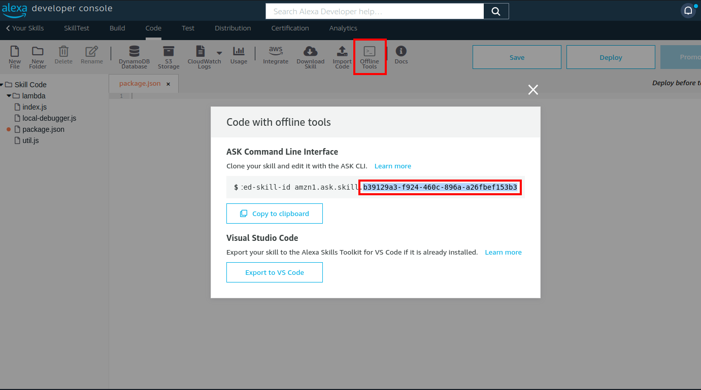

<h1 align="center">
  <br>
  <a href="https://github.com/ODGodinho"></a>
  <br>
  Stanley Alexa Skill By Dragons Gamers
  <br>
</h1>

<h4 align="center">Template Stanley for Alexa skill in typescript hosted by Alexa server 🖱️!</h4>

<p align="center">

  

  <a href="https://www.linkedin.com/in/victor-alves-odgodinho/">
    
  </a>

  <a href="https://github.com/ODGodinho/Stanley-Alexa/commits/master">
    
  </a>

  

   <a href="https://github.com/ODGodinho/Stanley-Alexa/stargazers">
    
  </a>

</p>

## Table of Contents

- [Libraries](#-libraries)
- [Dependencies](#-dependencies)
- [Installing and Updating](#installing-or-updating)
  - [Install](#install)
- [Start Project](#start-project)


---

## 🖥 Libraries

#### `Crawler`

- [Node.js](https://nodejs.org/)
- [Typescript](https://www.typescriptlang.org/)
- [Eslint](https://eslint.org/)
- [ODG-Linter-JS](https://github.com/ODGodinho/ODG-Linter-Js)

## 📁 Dependencies

#### `Crawler`

- [Node.js](https://nodejs.org) 14 or later
- [Yarn](https://yarnpkg.com/) Optional/Recommended
- [Ask](https://www.npmjs.com/package/ask-cli) Last Version

## Installing Or Updating

---

### Install

Click in use this template button and clone template project

> remember to install all dependencies before starting this process.

#### Env Example

Copy .env.example to .env and change the values according to your needs.



```bash
chmod 776 ./start.sh ./build.sh
sh ./start.sh
# Fill folder with name `dist`
```

## Start Project

First install dependencies with the following command

```bash
yarn install
```

### Commit Init Project

after start the project, you can commit the initial project with the following command

```bash
git add .
git commit -m "feat(Init): :tada: initial commit project start"
git push
```

## Build

To build the project, you can use the following command

```bash
yarn build
```
