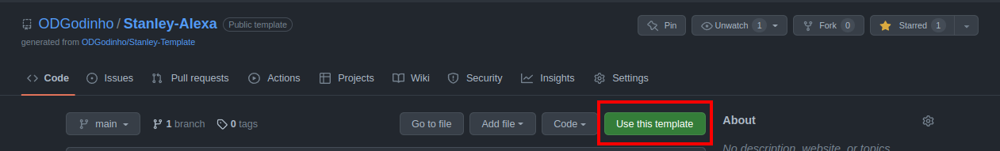

<h1 align="center">
  <br>
  <a href="https://github.com/ODGodinho"></a>
  <br>
  Stanley Alexa Skill By Dragons Gamers
  <br>
</h1>

<h4 align="center">Template Stanley for Alexa skill in typescript hosted by Alexa server 🖱️!</h4>

<p align="center">

  

  <a href="https://www.linkedin.com/in/victor-alves-odgodinho/">
    
  </a>

  <a href="https://github.com/ODGodinho/Stanley-Alexa/commits/master">
    
  </a>

  

   <a href="https://github.com/ODGodinho/Stanley-Alexa/stargazers">
    
  </a>

</p>

## Table of Contents

- [Libraries](#-libraries)
- [Dependencies](#-dependencies)
- [Get Started](#get-started)
  - [Use Template](#use-template)
  - [Create Alexa Skill](#create-alexa-skill)
  - [Prepare to develop](#prepare-to-develop)
  - [Start Project](#start-project)
- [Prepare Deploy](#prepare-deploy)

---

## 🖥 Libraries

#### `Crawler`

- [Node.js](https://nodejs.org/)
- [Typescript](https://www.typescriptlang.org/)
- [Eslint](https://eslint.org/)
- [ODG-Linter-JS](https://github.com/ODGodinho/ODG-Linter-Js)

## 📁 Dependencies

#### `Crawler`

- [Node.js](https://nodejs.org) 14 or later
- [Yarn](https://yarnpkg.com/) Optional/Recommended
- [Ask](https://www.npmjs.com/package/ask-cli) Last Version

## Get Started

---

### Use Template

> Click in use this template button and clone your template project



### Create Alexa Skill

Open Alexa console in <https://developer.amazon.com/alexa/console/ask> and follow the steps

- Create Skill
- Choose a model to add to your skill: `use Custom`
- Select `Alexa-hosted (Node.js)`
- Click `Create Skill`
- Select `start from Scratch`
- Click `Continue with Template`

#### Prepare To Develop

Copy `.env.example` to `.env` and change the values according to your needs.

```properties
ALEXA_SKILL_UUID="00000000-0000-0000-0000-000000000000" 
# As in the image below
```


```bash
chmod 774 ./start.sh ./build.sh ./deploy.sh
sh ./start.sh
# Fill folder with name `dist`
```

### Start Project

First install dependencies with the following command

```bash
yarn install
# or
npm install
```

after start the project, you can commit the initial project with the following command

```bash
git add .
git commit -m "feat(Init): :tada: initial commit project start"
git push
```

## Build And Test

To build the project, you can use the following command

> if you change files, you need to run `yarn build` and `yarn debug` again

```bash
yarn build
yarn debug
```

### Request Example Intent

Run this request and test the response, you can change the `Intent` name and the `Slot` name

```powershell
curl --location --request GET 'http://localhost:8035' \
--header 'Content-Type: application/json' \
--data-raw '{
 "version": "1.0",
 "session": {
  "new": false,
  "sessionId": "amzn1.echo-api.session.4edcfe44-df87-11ec-9d64-0242ac120002",
  "application": {
   "applicationId": "amzn1.ask.skill.4edcfe44-df87-11ec-9d64-0242ac120002"
  },
  "attributes": {},
  "user": {
   "userId": "amzn1.ask.account."
  }
 },
 "context": {
  "Viewports": [
   {
    "type": "APL",
    "id": "main",
    "shape": "RECTANGLE",
    "dpi": 213,
    "presentationType": "STANDARD",
    "canRotate": false,
    "configuration": {
     "current": {
      "mode": "HUB",
      "video": {
       "codecs": [
        "H_264_42",
        "H_264_41"
       ]
      },
      "size": {
       "type": "DISCRETE",
       "pixelWidth": 1280,
       "pixelHeight": 800
      }
     }
    }
   }
  ],
  "Viewport": {
   "experiences": [
    {
     "arcMinuteWidth": 346,
     "arcMinuteHeight": 216,
     "canRotate": false,
     "canResize": false
    }
   ],
   "mode": "HUB",
   "shape": "RECTANGLE",
   "pixelWidth": 1280,
   "pixelHeight": 800,
   "dpi": 213,
   "currentPixelWidth": 1280,
   "currentPixelHeight": 800,
   "touch": [
    "SINGLE"
   ],
   "video": {
    "codecs": [
     "H_264_42",
     "H_264_41"
    ]
   }
  },
  "Extensions": {
   "available": {
    "aplext:backstack:10": {}
   }
  },
  "System": {
   "application": {
    "applicationId": "amzn1.ask.skill.4edcfe44-df87-11ec-9d64-0242ac120002"
   },
   "user": {
    "userId": "amzn1.ask.account."
   },
   "device": {
    "deviceId": "amzn1.ask.device.",
    "supportedInterfaces": {}
   },
   "apiEndpoint": "https://api.amazonalexa.com",
   "apiAccessToken": ""
  }
 },
 "request": {
  "type": "IntentRequest",
  "requestId": "amzn1.echo-api.request.4edcfe44-df87-11ec-9d64-0242ac120002",
  "locale": "pt-BR",
  "timestamp": "2022-05-29T19:29:21Z",
  "intent": {
   "name": "GithubStarsIntent",
   "confirmationStatus": "NONE"
  }
 }
}'
```

## Prepare Deploy

To prepare to deploy your Alexa application only run

```bash
sh ./deploy.sh
```
